# gmail-mcp

A local [MCP](https://modelcontextprotocol.io) server that gives Claude
access to several Gmail accounts at once — search, read, draft, send,
label, and a scheduled cross-inbox digest — without switching mailboxes.

Runs entirely on your machine. Nothing is hosted; mail goes only to Google.

## The problem

Running several mailboxes — personal, sales, support, billing — means
switching between them all day. AI assistants don't fix it: they connect to
one account, or take broad access with no way to say *this one may send,
that one may not*. Unrestricted send access to a client-facing address is
why most people never connect one at all.

## Who it's for

Freelancers, agencies and small teams with several Gmail or Workspace
mailboxes who want an assistant across all of them, and a hard guarantee
about what it can send.

## What it does

Ten tools, each taking an explicit `account` alias so the mailbox is never
ambiguous.

| Tool | Purpose |
| --- | --- |
| `list_accounts` | Aliases, addresses, send policies |
| `search_mail` | Gmail query syntax against one account |
| `read_message` / `read_thread` | Full body; threads with quotes collapsed |
| `create_draft` / `send_message` / `send_draft` | Compose, gated by policy |
| `list_labels` / `modify_labels` | Labels — also marks read and archives |
| `check_inboxes` | New unread across every account, for scheduled use |

**Send safety is the core design decision.** Each mailbox declares `send`,
`confirm`, or `draft_only` in config, enforced in code rather than in a
prompt — so neither the model nor anything written into the mail it reads
can talk it out of it. `check_inboxes` reads untrusted email on a schedule,
which is exactly why that control can't live in an instruction.

## Architecture

```mermaid
flowchart TD
    H["Claude Desktop · Claude Code"] -->|stdio| S["server.py<br/>10 tools — validate, delegate, shape"]
    S --> P{"send policy gate<br/>send · confirm · draft_only"}
    P -->|blocked| D["draft"]
    P -->|allowed| T["transmit"]
    S --> G["gmail/<br/>search · messages · compose · labels"]
    S --> C["check.py<br/>parallel watermarked sweep"]
    G --> CL["client.py<br/>retry · error mapping · per-account cache"]
    C --> CL
    T --> CL
    CL --> A["auth.py — OAuth refresh"]
    A --> ST["storage.py<br/>OS keyring, or 0600 file"]
    CL --> API[("Gmail API — gmail.modify")]
```



Every Gmail call passes through one choke point owning retries and error
mapping, and each account gets its own service object — which is what makes
the parallel sweep safe. `check_inboxes` keeps a per-account watermark, so
a scheduled run reports only genuinely new mail.

## Setup

Full guide: **[docs/SETUP.md](docs/SETUP.md)**.

**1. Google Cloud** — enable the Gmail API, configure an OAuth consent
screen (Internal for a Workspace domain, External for consumer Gmail), add
the single scope `gmail.modify`, create a **Desktop app** OAuth client, and
save the JSON as `client_secret.json` in your config directory.

**2. Install**

```bash
git clone <this repo> && cd gmail-mcp
uv sync
cp config.example.toml <config-dir>/config.toml   # then edit it
uv run gmail-mcp auth add <alias>                 # once per account
uv run gmail-mcp doctor                           # verify every account
```

| OS | Config directory |
| --- | --- |
| Linux | `~/.config/gmail-mcp/` |
| macOS | `~/Library/Application Support/gmail-mcp/` |
| Windows | `%LOCALAPPDATA%\gmail-mcp\` |

**3a. Claude Code** — any OS:

```bash
claude mcp add gmail --scope user -- \
  /absolute/path/to/uv --directory /absolute/path/to/gmail-mcp run gmail-mcp serve
```

**3b. Claude Desktop** — add to `claude_desktop_config.json`:

```json
{
  "mcpServers": {
    "gmail": {
      "command": "/absolute/path/to/uv",
      "args": ["--directory", "/absolute/path/to/gmail-mcp",
               "run", "gmail-mcp", "serve"]
    }
  }
}
```

| OS | Config file |
| --- | --- |
| macOS | `~/Library/Application Support/Claude/claude_desktop_config.json` |
| Windows | `%APPDATA%\Claude\claude_desktop_config.json` |
| Linux | `~/.config/Claude/claude_desktop_config.json` |

Absolute paths in both: neither host inherits a shell `PATH`, and a bare
command name is the usual reason a server silently fails to start.

## Demo

> 📹 **Recording:** _add link here_

Local server, so no hosted instance. Two moves:

1. *"Check all my inboxes and tell me what needs my attention."* Ask again
   — nothing new, because each account remembers where it got to.
2. *"Send this from my personal account."* It returns a **draft** and names
   the policy that stopped it.

## Design notes

- **Least privilege.** One scope, `gmail.modify` — which cannot permanently
  delete mail. Chosen, not inherited.
- **Credentials** live in the OS keyring (Keychain, Credential Manager,
  Secret Service), falling back to a `0600` file. Deliberately not
  encrypted: the server starts unattended, so any key would sit beside the
  ciphertext.
- **Failure isolation.** A revoked token fails one mailbox and names the
  fix; the others keep working.
- **Correct replies.** `In-Reply-To` and `References` are set, so replies
  thread in Outlook and Apple Mail — not only Gmail.
- **Cross-platform** via `platformdirs` and `keyring`.

## Development

```bash
uv sync && uv run pytest
```

193 tests, written test-first, running offline against a fake Gmail API —
no network, credentials, or live mailbox needed. One opt-in integration
test covers the real OAuth round trip.
